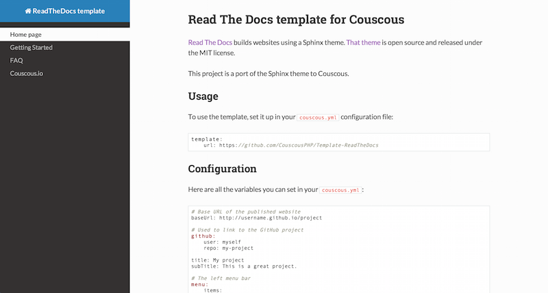

# Read The Docs template for Couscous

[Read The Docs](https://readthedocs.org/) builds websites using a Sphinx theme. [That theme](https://github.com/snide/sphinx_rtd_theme) is open source and released under the MIT license.

This project is a port of the Sphinx theme to Couscous.



## Usage

To use the template, set it up in your `couscous.yml` configuration file:

```yaml
template:
    url: https://github.com/CouscousPHP/Template-ReadTheDocs
```

## Configuration

Here are all the variables you can set in your `couscous.yml`:

```yaml
# Base URL of the published website
baseUrl: http://username.github.io/project

# Used to link to the GitHub project
github:
    user: myself
    repo: my-project

title: My project
subTitle: This is a great project.

# The left menu bar
menu:
    items:
        home:
            text: FAQ
            # You can use relative urls
            relativeUrl: doc/faq.html
        foo:
            text: Another link
            # Or absolute urls
            absoluteUrl: https://example.com
```

Note that the menu items can also contain HTML:

```yaml
home:
    text: "<i class=\"fa fa-github\"></i> FAQ"
    relativeUrl: doc/faq.html
```

## Menu

To set the current menu item (i.e. highlighted menu item), set the `currentMenu`
key in the Markdown files:

```markdown
---
currentMenu: home
---

# Welcome
```

## TODO

Want to help?

The original template came with a lot of SASS files and features. Some features are not ported to this Couscous template (e.g. the search).

What would be good to do:

- find a way to cleanly handle the SASS files and the `theme.css` (which contains the generated/minified CSS) which right now are duplicates. Relying on SASS wouldn't be a good idea though since it would be end-users have to install SASS.
- clean up unused CSS and SASS style (e.g. search bar, …)

In the meantime, the original minified `theme.css` is used and it works just great.
